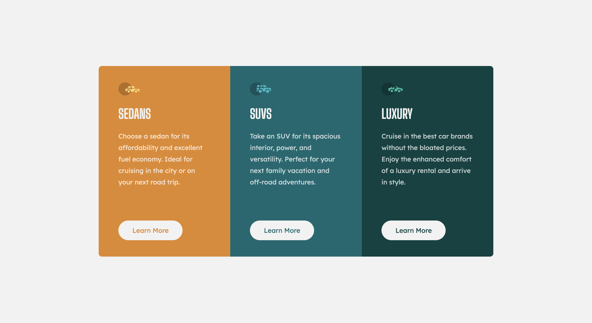

# Frontend Mentor - 3-column preview card component solution

This is a solution to the [3-column preview card component challenge on Frontend Mentor](https://www.frontendmentor.io/challenges/3column-preview-card-component-pH92eAR2-). Frontend Mentor challenges help you improve your coding skills by building realistic projects. 

## Table of contents

- [Overview](#overview)
  - [The challenge](#the-challenge)
  - [Screenshot](#screenshot)
  - [Links](#links)
- [My process](#my-process)
  - [Built with](#built-with)
  - [What I learned](#what-i-learned)
  - [Continued development](#continued-development)
  - [Useful resources](#useful-resources)
- [Author](#author)
- [Acknowledgments](#acknowledgments)

## Overview

### The challenge

Users should be able to:

- View the optimal layout depending on their device's screen size
- See hover states for interactive elements

### Screenshot

### Links

- Solution URL: [https://www.frontendmentor.io/solutions/3columncard-solution-gJg7XIYvd](https://www.frontendmentor.io/solutions/3columncard-solution-gJg7XIYvd)
- Live Site URL: [https://harshsaini13.github.io/3-column-card-component/](https://harshsaini13.github.io/3-column-card-component/)

## My process

### Built with

- Semantic HTML5 markup
- CSS custom properties
- Flexbox
- Mobile-first workflow

### What I learned

Came to know that Mobile-first workflow can be very fast and can reduce a lot of headache.
I had used much relative units in this project.

### Continued development

Not comfortable with position property, will focus on it in next project.

### Useful resources

- [How to Take the Right Approach to Responsive Web Design?](https://www.freecodecamp.org/news/taking-the-right-approach-to-responsive-web-design/) - An article to know why you should start with mobile first workflow.

## Author

- Frontend Mentor - [@HarshSaini13](https://www.frontendmentor.io/profile/HarshSaini13)
- Twitter - [harshsaini1303](https://www.twitter.com/harshsaini1303)

